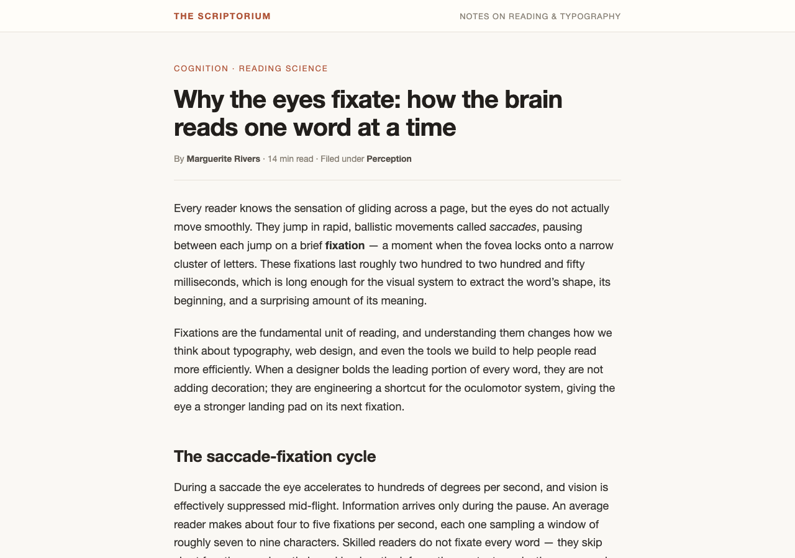
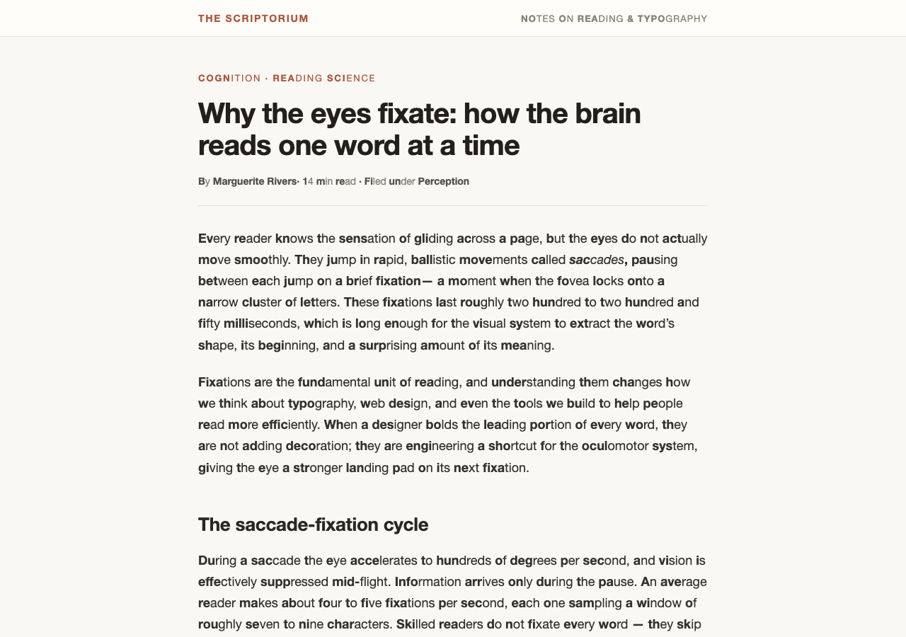
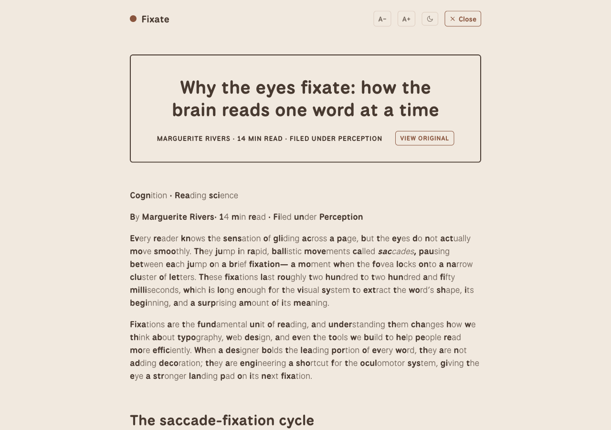
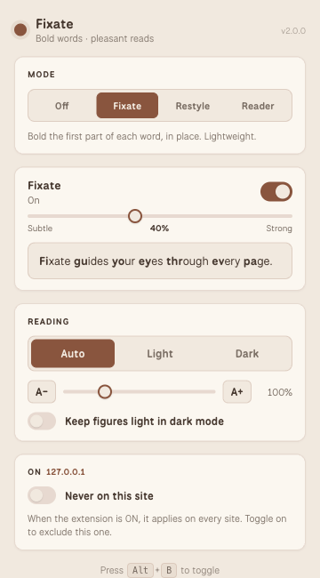

# Fixate

A Chrome extension that helps you read the web — bold the first part of every word so your eyes fixate faster, and optionally rebuild the page in a calm, pleasant reader view (warm earthy palette, custom typography, distraction-free article extraction) inspired by pleasant-reader.

There is one mode (On or Off). When it's On, Fixate runs and you can layer two optional reading styles on top:

- **Fixate** — bolds the leading part of each word in place. Lightweight; keeps the page's own layout and colors. Always available.
- **Restyle** — repaints the page with a warm earthy palette and bundled fonts in place. Cleaner than the bare Fixate mode, lighter than Reader.
- **Reader** — extracts the article and rebuilds it in an isolated ~65-character column with fluid typography. Best for long-form.

Restyle and Reader are independent toggles. When both are on, Reader wins (it covers the whole viewport, so Restyle underneath would be hidden). The bolding is independent of everything: toggle it on/off and adjust its intensity inside any combination. The other reading controls (theme, text size, keep figures light) apply whenever Restyle or Reader is on.

## Screenshots

The same article in three states — untouched, with Fixate's bolded prefixes, and rebuilt by Reader:

| Plain page | Fixate — bolded prefixes |
|---|---|
|  |  |

| Reader — distraction-free column |
|---|
|  |

The popup controls the mode, Fixate toggle + intensity, Restyle/Reader style toggles, theme, and text size:



## Features

- **One mode, layered reading styles** — Off/On master switch, with Fixate (always-on bolded prefixes) and optional Restyle + Reader toggles
- **Adjustable intensity** (20–70%) for the bolded prefix, with a live preview in the popup
- **Warm earthy palette** — cream background, rust accent, dark brown headings, body text in muted brown
- **Bundled fonts** — National Park (body), Playfair Display (headings), Fragment Mono (code). All woff2, served from the extension so it works on strict-CSP pages and offline
- **Light / Dark / Auto** theme with `prefers-color-scheme` awareness
- **Adjustable text size** (80–160%) — separate from page zoom
- **Code syntax highlighting** — language-agnostic tokenizer with a Monokai palette
- **Per-site opt-out** — when ON, the extension applies on every site. Flip **Never on this site** in the popup to exclude the current hostname
- **Keyboard shortcut** — `Alt+B` toggles the active mode on the current page
- **Toolbar badge** — shows "ON" when a mode is active
- **Shadow-DOM isolation** for Reader mode — page CSS can't leak in, reader CSS can't leak out
- **Inline `!important` security guards** on the Reader host element so page CSS can't hide or de-stack the reader
- **DOM walker + MutationObserver** — dynamic content (SPAs, infinite scroll) gets the same treatment
- **Settings sync** via `chrome.storage.sync`

## Install (unpacked)

1. Open `chrome://extensions` (Chrome, Edge, Brave, Arc, etc.).
2. Toggle **Developer mode** on (top right).
3. Click **Load unpacked** and select this folder.
4. Pin the icon. Click it to open the popup and pick a mode.

To re-load after editing files, hit the circular refresh icon on the extension's card.

## Usage

- **Mode** — Off or On. Your choice is remembered; the next page you visit starts in the same mode.
- **Fixate toggle** — enable/disable the bolded-prefix effect. Always available, even when no reading style is on.
- **Intensity** — drag the slider. The popup preview updates live so you can feel the effect.
- **Reading style** — toggle Restyle, Reader, both, or neither. Reader covers the page when on, hiding Restyle.
- **Theme / Text size / Keep figures light** — apply whenever Restyle or Reader is on.
- **This site → Never on this site** — excludes the current hostname. Everything else still gets the extension.
- **Alt+B** — toggles the active mode on the current page. Rebind at `chrome://extensions/shortcuts`.

## How the layers compose

| Mode | Reading style | What you see | Bolded prefix | Theme | Font scale | Code highlight |
|------|---|---|:---:|:---:|:---:|:---:|
| Off | — | Page unchanged | — | — | — | — |
| On | (neither) | Page, with first part of each word bolded | ✓ | inherited from page | inherited from page | inherited from page |
| On | Restyle | Page, repainted with warm palette and bundled fonts | ✓ | ✓ | ✓ | — |
| On | Reader | Extracted article in a clean column, Shadow-DOM-isolated | ✓ | ✓ | ✓ | ✓ |

When both Restyle and Reader are on, Reader wins (it covers the whole viewport). The bolding is the same function in every active configuration — it runs on `document.body` (Fixate, Restyle) or the shadow-DOM `.article-body` (Reader). The wrapper uses `display: contents` so it never shifts layout.

## Project structure

```
fixate/
├── manifest.json         MV3, content scripts, web-accessible resources
├── background.js         Alt+B shortcut, toolbar badge, default seeding + migration
├── fixate.js             text transform module — apply/unapply/update/isApplied
├── content.js            orchestrator: mode, layers (Fixate/Restyle/Reader), themes, state, messaging
├── readability.js        article extraction (Readability-inspired)
├── fixate.css            wrapper styles for the host page
├── restyle.css           in-place warm repaint
├── reader.css            reader theme loaded into a Shadow DOM
├── popup.html / .css / .js
├── screenshots/           README captures (popup + modes)
├── fonts/                6 woff2 files (latin + latin-ext for 3 families)
└── icons/                16/32/48/128 px PNG + SVG source
```

## How the bolded-prefix transform works

For each word of length *n* at intensity *i* (0.2–0.7), the first `max(1, round(n × i))` characters get wrapped in `<b>`. The original text is stashed in `data-fixate-original` on the wrapper, so toggling off is a literal string restore — no re-derivation, idempotent across many on/off cycles. The wrapper itself is `display: contents`, so the box tree is identical to the original.

A `MutationObserver` (debounced at 80 ms) watches the active root so dynamic content gets the same treatment without thrashing.

## Privacy

No network requests, no analytics, no remote code. The only data the extension stores is your settings, kept in `chrome.storage.sync` so they follow your Google account.

## License

MIT.
